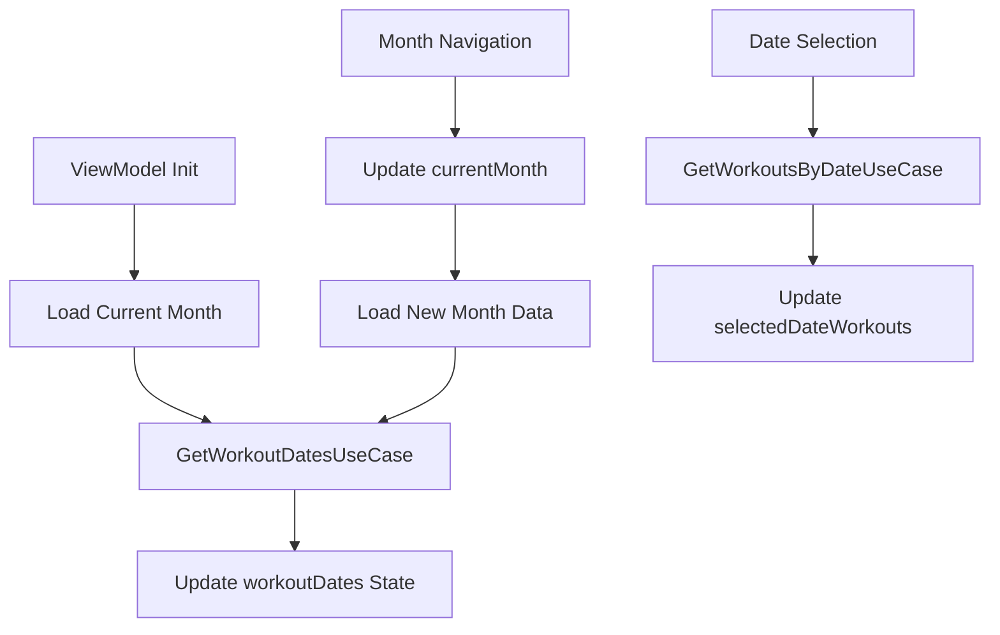

# Calendar Feature Implementation Guide

## Overview

The WorkRec calendar feature provides a comprehensive workout tracking interface with monthly calendar views, date selection, and workout visualization. This document details the implementation architecture, testing strategy, and development guidelines for the calendar functionality.

## Architecture Overview

### Component Hierarchy

```
WorkoutListScreen (Calendar Layout)
├── CalendarNavigationHeader
│   ├── Month/Year Display
│   ├── Navigation Buttons (Previous/Next)
│   └── Today Button
├── MonthlyCalendarGrid
│   ├── Day-of-Week Headers
│   └── CalendarDayCell (42 cells for 6 weeks)
│       ├── Date Display
│       ├── Workout Indicator
│       ├── Selection State
│       └── Today Highlight
└── SelectedDateWorkoutList
    ├── Date Header
    ├── WorkoutSummaryCard (per workout)
    └── Empty State Message
```

### State Management

The calendar functionality is managed through `WorkoutViewModel` with dedicated state properties:

```kotlin
data class WorkoutUiState(
    // Core workout functionality
    val workouts: List<Workout> = emptyList(),
    val isLoading: Boolean = false,
    val message: String? = null,
    val errorMessage: String? = null,
    
    // Calendar-specific state
    val currentMonth: YearMonth = YearMonth.now(),
    val selectedDate: LocalDate? = null,
    val workoutDates: Set<LocalDate> = emptySet(),
    val selectedDateWorkouts: List<Workout> = emptyList(),
    val isLoadingWorkouts: Boolean = false
)
```

## Key Components

### 1. CalendarNavigationHeader

**Purpose**: Month navigation and current date display

**Features**:
- Month/year display with localized formatting
- Previous/next month navigation
- "Today" button for quick navigation
- Responsive design with proper touch targets

**Implementation**:
```kotlin
@Composable
fun CalendarNavigationHeader(
    currentMonth: YearMonth,
    onPreviousMonth: () -> Unit,
    onNextMonth: () -> Unit,
    onTodayClick: () -> Unit,
    modifier: Modifier = Modifier
)
```

### 2. MonthlyCalendarGrid

**Purpose**: Monthly calendar display with workout indicators

**Features**:
- 7-column grid layout (Sunday to Saturday)
- Day-of-week headers
- Previous/next month date display
- Workout presence indicators
- Date selection handling

**Implementation**:
```kotlin
@Composable
fun MonthlyCalendarGrid(
    monthData: MonthData,
    selectedDate: LocalDate?,
    onDateSelected: (LocalDate) -> Unit,
    modifier: Modifier = Modifier
)
```

### 3. CalendarDayCell

**Purpose**: Individual calendar day display

**Features**:
- Date number display
- Workout indicator (dot)
- Selection state styling
- Today highlighting
- Accessibility support

**States**:
- **Normal**: Default appearance
- **Selected**: Primary color background
- **Today**: Primary container background
- **Has Workout**: Indicator dot
- **Previous/Next Month**: Dimmed appearance

### 4. SelectedDateWorkoutList

**Purpose**: Display workouts for selected date

**Features**:
- Selected date header
- Workout summary cards
- Empty state handling
- Loading state display

## Data Flow

### Calendar Data Loading



### Use Cases Integration

- **GetWorkoutDatesUseCase**: Retrieves workout dates for a specific month
- **GetWorkoutsByDateUseCase**: Retrieves detailed workouts for a selected date

## Responsive Design

### Screen Size Adaptation

The calendar implements responsive design through `ResponsiveUtils`:

```kotlin
// Screen size categories
enum class ScreenSize {
    COMPACT,    // < 600dp (phones)
    MEDIUM,     // 600-840dp (tablets)
    EXPANDED    // > 840dp (large tablets/desktop)
}
```

### Layout Configurations

| Screen Size | Layout | Cell Size | Padding |
|-------------|--------|-----------|---------|
| **Compact** | Vertical Stack | 48dp | 8dp |
| **Medium** | Enhanced Spacing | 56dp | 16dp |
| **Expanded** | Side-by-Side | 64dp | 24dp |

### Responsive Features

- **Touch Targets**: Minimum 48dp for accessibility
- **Adaptive Layouts**: Phone vs tablet layouts
- **Spacing**: Screen-size appropriate padding
- **Typography**: Responsive text scaling

## Accessibility Implementation

### Content Descriptions

Calendar cells provide comprehensive accessibility information:

```kotlin
// Example content description
"3月15日, ワークアウト2件, 今日"
// "March 15th, 2 workouts, today"
```

### Semantic Roles

- Calendar cells: `Role.Button`
- Navigation buttons: Proper labeling
- Grid structure: Screen reader compatible

### Keyboard Navigation

Supported through `CalendarKeyboardNavigation` wrapper:

- **Arrow Keys**: Date navigation
- **Page Up/Down**: Month navigation
- **Home**: Navigate to today
- **Enter/Space**: Date selection

## Testing Strategy

### Test Architecture

The calendar feature uses a **specialized testing approach** with dedicated test classes to ensure comprehensive coverage while maintaining test clarity and performance.

#### 1. Feature-Specific Tests

**`WorkoutCalendarFeatureTest.kt`**
- **Purpose**: Calendar business logic and ViewModel integration
- **Scope**: Month navigation, date selection, data loading
- **Focus**: State management and use case integration

**Key Test Scenarios**:
```kotlin
@Test
fun `カレンダー初期状態_正しく設定されること`()

@Test
fun `月間ナビゲーション_連続した月移動が正しく動作すること`()

@Test
fun `日付選択_複数の日付選択が正しく動作すること`()
```

#### 2. Workflow Tests

**`WorkoutCalendarWorkflowTest.kt`**
- **Purpose**: Complex user interaction scenarios
- **Scope**: Multi-step workflows and state transitions
- **Focus**: User experience validation

**Key Test Scenarios**:
```kotlin
@Test
fun calendarNavigationWorkflow_multipleMonthNavigationMaintainsState()

@Test
fun calendarDateSelection_multipleSelectionsMaintainState()

@Test
fun todayButtonNavigation_returnsToCurrentMonth()
```

#### 3. Integration Tests

**`WorkoutCalendarIntegrationTest.kt`**
- **Purpose**: UI component integration
- **Scope**: Component interactions and visual behavior
- **Focus**: Compose component testing

**Key Test Scenarios**:
```kotlin
@Test
fun calendarNavigationHeader_displaysCorrectMonthAndNavigationButtons()

@Test
fun monthlyCalendarGrid_displaysCalendarDaysInGrid()

@Test
fun selectedDateWorkoutList_displaysWorkoutsForSelectedDate()
```

#### 4. Accessibility Tests

**`CalendarAccessibilityTest.kt`**
- **Purpose**: Accessibility compliance and responsive design
- **Scope**: Content descriptions, touch targets, responsive layouts
- **Focus**: Inclusive design validation

### Test Separation Benefits

#### 1. Maintainability
- Each test class has a single, clear responsibility
- Easy to locate and update specific test scenarios
- Reduced test interdependencies

#### 2. Performance
- Targeted test execution: `./gradlew test --tests "*Calendar*"`
- Faster feedback loops during development
- Parallel test execution capabilities

#### 3. Clarity
- Test purpose is immediately clear from class name
- Focused test scenarios without unrelated setup
- Better test documentation and examples

#### 4. Scalability
- Easy to add new calendar features without affecting existing tests
- Clear patterns for testing similar complex features
- Isolated test environments

### ViewModel Test Optimization

The main `WorkoutViewModelTest.kt` focuses on **core functionality**:

```kotlin
// Core workout operations
@Test
fun `addWorkout_成功時に適切な状態更新が行われること`()

@Test
fun `deleteWorkout_成功時に適切な状態更新が行われること`()

// Basic error handling
@Test
fun `clearError_エラーメッセージがクリアされること`()
```

**Calendar-specific tests** are handled in dedicated test classes, providing:
- **Separation of Concerns**: Core vs feature-specific testing
- **Focused Testing**: Each test class tests one aspect thoroughly
- **Better Organization**: Easier to navigate and maintain

## Development Guidelines

### Adding New Calendar Features

1. **Component Development**:
   - Create Compose component in `ui/components/`
   - Follow responsive design patterns
   - Implement accessibility features

2. **State Management**:
   - Add state properties to `WorkoutUiState`
   - Implement ViewModel methods
   - Handle loading and error states

3. **Testing**:
   - Add unit tests to appropriate feature test class
   - Create integration tests for UI components
   - Verify accessibility compliance

### Code Style

- **Naming**: Use descriptive Japanese test names for clarity
- **Structure**: Follow established component patterns
- **Documentation**: Include comprehensive KDoc comments
- **Accessibility**: Always implement proper content descriptions

### Performance Considerations

- **Lazy Loading**: Use `LazyVerticalGrid` for efficient rendering
- **State Optimization**: Minimize unnecessary recompositions
- **Memory Management**: Proper cleanup of resources
- **Data Caching**: Efficient workout date caching

## Future Enhancements

### Planned Features

1. **Week View**: Alternative calendar layout
2. **Workout Density Visualization**: Heat map style indicators
3. **Quick Actions**: Swipe gestures for common operations
4. **Customizable Views**: User-configurable calendar appearance

### Technical Improvements

1. **Performance Optimization**: Further reduce recompositions
2. **Animation Enhancement**: Smooth transitions between months
3. **Offline Sync**: Better handling of data synchronization
4. **Accessibility**: Enhanced screen reader support

## Conclusion

The calendar feature implementation demonstrates modern Android development best practices with:

- **Clean Architecture**: Clear separation of concerns
- **Responsive Design**: Adaptive layouts for all screen sizes
- **Comprehensive Testing**: Specialized test strategy for complex features
- **Accessibility First**: Inclusive design from the ground up
- **Performance Focused**: Efficient rendering and state management

This architecture provides a solid foundation for future calendar enhancements while maintaining code quality and user experience standards.